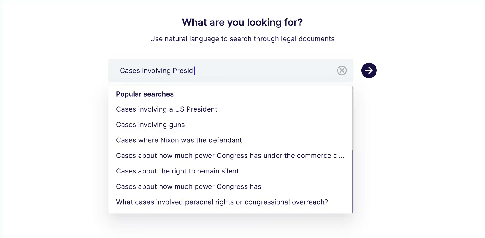
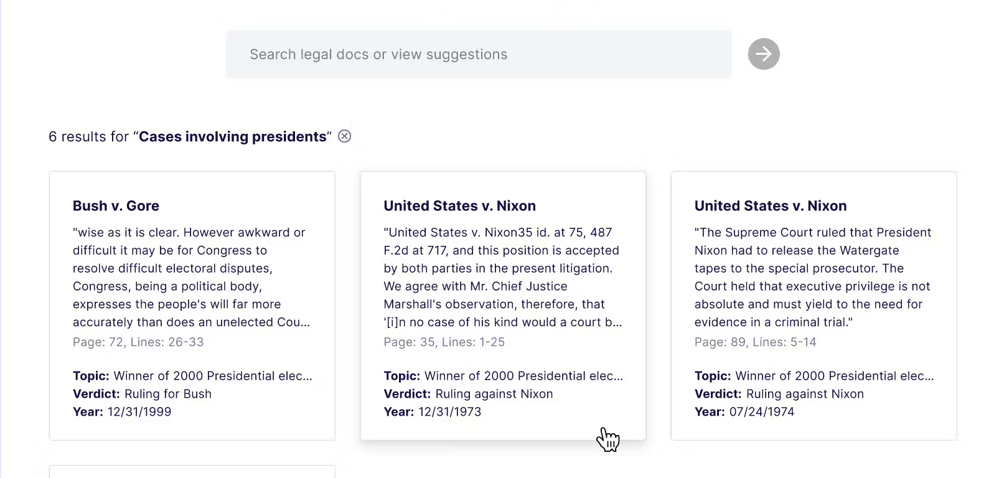

# Legal semantic search

### Self-bootstrapping legal case semantic search sample app



Use natural language to search over legal cases stored in PDFs using Pinecone, LangChain and Voyage's domain-specific embeddings model.



This app demonstrates how to programmatically bootstrap a custom knowledge base based on a Pinecone vector database with arbitrary PDF files included in the codebase.

The sample app use case is focused on semantic search over legal documents, but this exact same technique and code can be applied to any content stored locally.

### Built With

- Pinecone Serverless
- Voyage Embeddings
- Langchain
- Next.js + tailwind
- Node version 20 or higher

---

## Running the Sample App

### Want to move fast?

Use `npx create-pinecone-app` to adopt this project quickly.

### Create a Pinecone API key

**Grab an API key here**

<div id="pinecone-connect-widget"></div>

This application will detect if you already have an index of the same name as the value
you set in your `PINECONE_INDEX` environment variable.

If you don't already have an index, the application will create one for you with the correct dimenions.

### Create a Voyage embeddings API key

Create a new account [here](https://www.voyageai.com/).

Log into [the Voyage AI dashboard](https://dash.voyageai.com/) and create a new API key [here].

### Start the project

**Requires Node version 20+**

#### Dependency installation

From the project root directory, run the following command.

```bash
cd legal-semantic-search && npm install --force
```

Make sure you have populated the client `.env` with relevant keys.

```bash
# You must first activate a Billing Account here: https://www.voyageai.com/
# Then get your Voyage API Key here: https://dash.voyageai.com/
VOYAGE_API_KEY="your-api-key-here"

# Get your Pinecone API key here: https://app.pinecone.io/
PINECONE_API_KEY="your-api-key-here"
PINECONE_INDEX="legal_semantic_search" # Or any other name you wish
```

Start the app.

```bash
npm run dev
```

## Project structure

In this example we opted to use a standard Next.js application structure.

**Frontend Client**

The frontend uses Next.js, tailwind and custom React components to power the search experience. It also leverages API routes to make calls to the server to initiate bootstrapping of the Pinecone vector database as a knowledge store, and to fetch relevant document chunks for the UI.

**Backend Server**

This project uses Next.js API routes to handle file chunking, upsertion, and context provision etc. Learn more about the implementation details below.

### Simple semantic search

This project uses a basic semantic search architecture that achieves low latency natural language search across all embedded documents. When the app is loaded, it performs background checks to determine if the Pinecone vector database needs to be created and populated.

**Componentized suggested search interface**

To make it easier for you to clone this app as a starting point and quickly adopt it to your own purposes, we've
built the search interface as a component that accepts a list of suggested searches and renders them as a dropdown, helping the
user find things:

You can define your suggested searches in your parent component:

```typescript
// For the purposes of our legal semantic search example, we pre-define some queries
// that we know will pull back interesting results for the user
const suggestedSearches = [
  'Cases about personal freedoms being violated',
  'Cases involving a US President',
  'Cases involving guns',
  'Cases where Nixon was the defendant',
  'How much power does the commerce clause give Congress?',
  'Cases about personal rights or congressional overreach?',
  'Cases involving the ability to pay for an attorney',
  ...
];

// Then, we pass them into our SearchForm component:
<SearchForm
  suggestedSearches={suggestedSearches}
  onSearch={(query: string) => {
    handleSearch(query, setResults, setIsSearching);
    setQuery(query);
  }}
/>

```

This means you can pass in any suggested searches you wish given your specific use case.

The SearchForm component is exported from `src/components/SearchForm.tsx`. It handles:

- Displaying suggested searches
- Allowing the user to search, or clear the input
- Providing visual feedback to the user that the search is in progress

**Local document processing via a bootstrapping service**

We store several landmark legal cases as PDFs in the codebase, so that developers cloning and running the app locally can immediately build off the same experience being demonstrated by the legal semantic search app running on our Docs site.

We use Langchain to parse the PDFs, convert them into chunks, and embed them. We store the resulting vectors in the Pinecone vector database.

**Knowledge base bootstrapping**

This project demonstrates how to programmatically bootstrap a knowledge base backed by a Pinecone vector database using arbitrary PDF files
that are included in the codebase.

The sample app use case is focused on semantic search over legal documents, but this exact same technique and code can be applied to any content stored locally.
